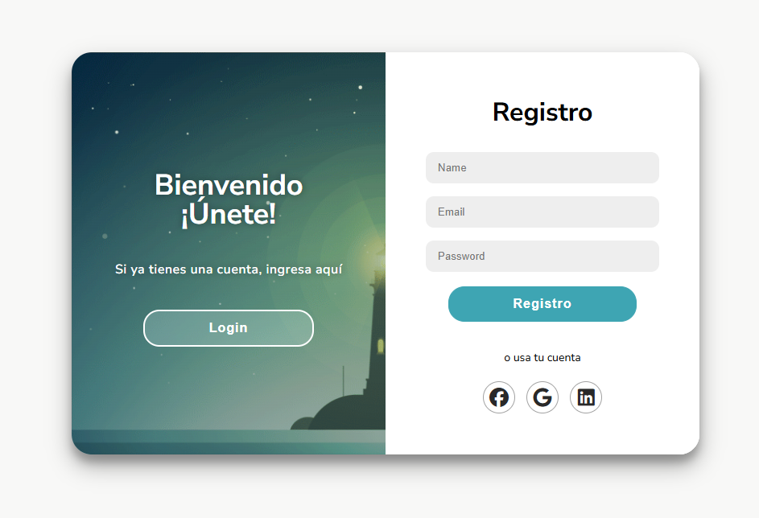
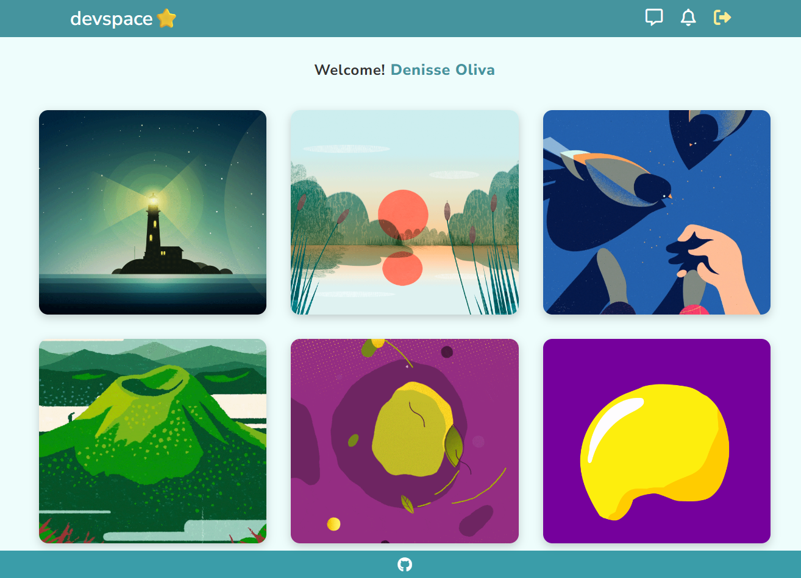

# Sistema de Autenticación con Interfaz

[Live DEMO](https://devspaces-5ncckm1d8-leidiths-projects.vercel.app/)

Un sistema completo de registro y login con validaciones, animaciones y dashboard personalizado






## Zod
Es una **librería de validación de esquemas** para TypeScript y JavaScript que permite:

- Definir estructuras de datos
- Validar información en runtime
- Interir tipos automáticamente
- Proporcionar mensajes de error descriptivos

### Instalación 
- **Opción A:** Usando npm 
```bash
npm install zod
```
- **Opción B:** CDN con navegadores (usado en este proyecto)
```html
<script src="https://cdn.jsdelivr.net/npm/zod@3.21.4/lib/index.umd.min.js"></script>
```

## Auntenticación segura
- **Registro de usuario** con validación Zod
- **Login** con verificación de credenciales
- **Persistencia de sesión** con localStorage
- **Logout** con confirmación